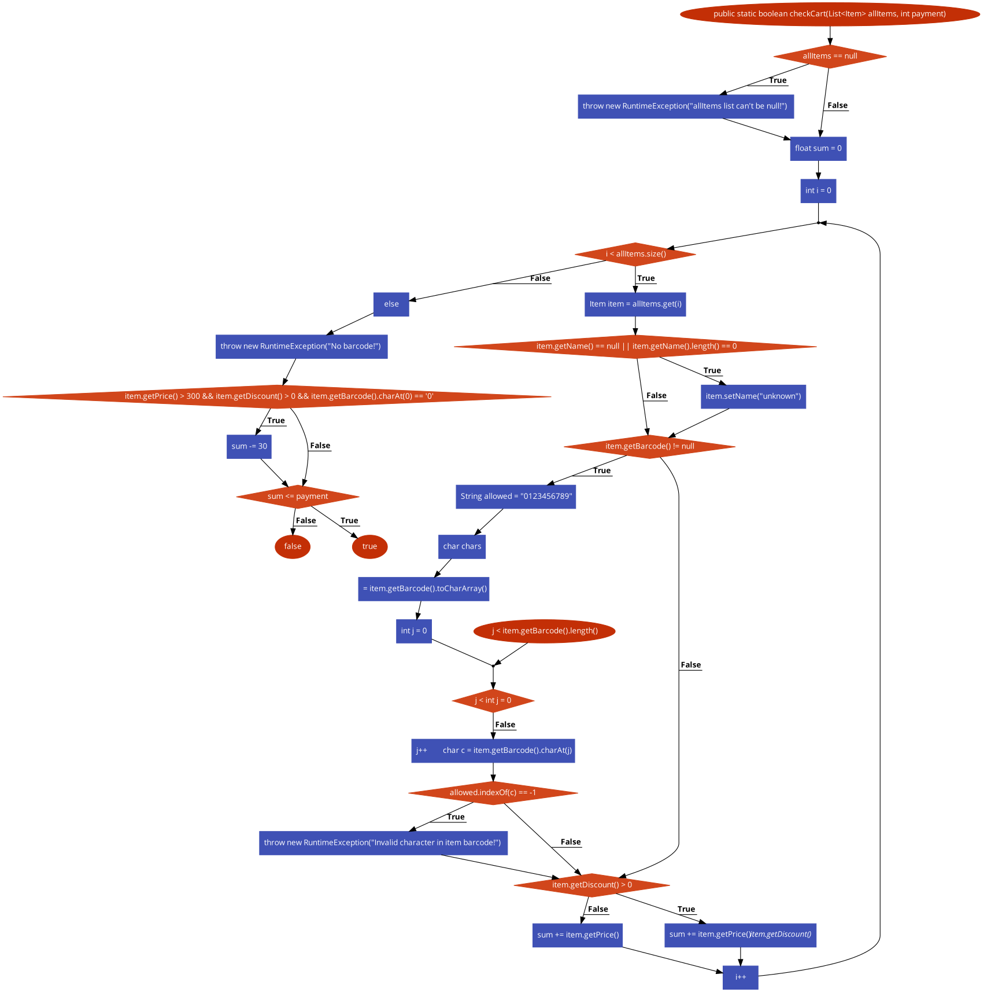

# Втора лабораториска вежба по Софтверско инженерство

## Бојан Гагалески, бр. на индекс 226032

###  Control Flow Graph

Фотографија од control flow graph-ot

### Цикломатска комплексност

### Тест случаи според критериумот Every branch

### Тест случаи според критериумот Multiple Condition

### Објаснување на напишаните unit tests
